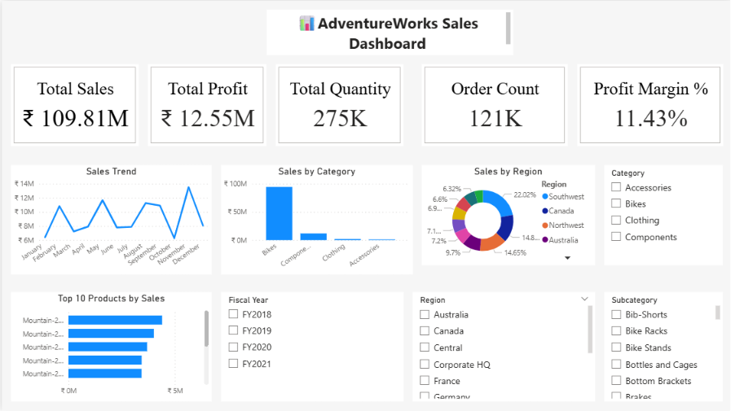

# AdventureWorks Sales Dashboard

An interactive **Sales Analytics Dashboard** built using **Microsoft Power BI** to analyze sales performance, profitability, products, customers, and regional trends using the AdventureWorks dataset.

The project demonstrates practical skills in **Power Query, DAX, data modeling, and business intelligence visualization**.

## 📊 Project Overview

The AdventureWorks Sales Dashboard transforms raw sales data into an interactive business intelligence solution.

The dashboard enables users to monitor key performance indicators, analyze sales and profitability trends, identify high-performing products and categories, and explore business performance across different regions and time periods.

## 🛠️ Tools & Technologies

* **Microsoft Power BI** – Dashboard development and data visualization
* **Power Query** – Data cleaning and transformation
* **DAX (Data Analysis Expressions)** – Calculated measures and analytical calculations
* **Data Modeling** – Relationships between fact and dimension tables
* **AdventureWorks Dataset** – Source data for the analysis


## 🎯 Business Objectives

The dashboard is designed to help answer questions such as:

* How are overall sales performing?
* How much profit is being generated?
* Which products and categories perform best?
* Which regions contribute the most to sales?
* How do sales change over time?
* Which customers or customer segments contribute significantly to revenue?
* What are the major sales and profitability trends?

## 📁 Dataset

The project uses the **AdventureWorks** dataset containing business data related to sales, products, customers, and other dimensions required for analytical reporting.

The data was imported into Power BI and prepared using Power Query before being used to create the analytical data model and dashboard.

## 🔄 Data Preparation

The following data preparation and transformation steps were performed using Power Query:

1. Imported the AdventureWorks data into Power BI.
2. Reviewed the structure and data types of the source tables.
3. Cleaned and transformed the data.
4. Handled data types and formatting where required.
5. Prepared tables for analytical modeling.
6. Established relationships between relevant tables.
7. Created a structured model for dashboard analysis.

## 🧩 Data Model

The dashboard uses a relational data model consisting of sales-related transactional data and supporting dimension tables.

A structured model allows the dashboard to analyze sales across multiple business dimensions such as:

* Products
* Product Categories
* Customers
* Geography / Regions
* Date / Time

The model was designed to support efficient filtering, aggregation, and DAX calculations.

## 📐 DAX & Measures

DAX was used to create analytical measures and KPIs for the dashboard.

Typical business metrics covered include:

* **Total Sales**
* **Total Profit**
* **Total Orders**
* **Total Quantity**
* **Profit Margin**
* **Sales Growth**
* Product and category performance metrics

Example DAX pattern:

```DAX
Profit Margin =
DIVIDE(
    [Total Profit],
    [Total Sales],
    0
)
```

These measures allow the dashboard to dynamically respond to filters and selections made by the user.

## 📈 Dashboard Features

The dashboard provides interactive analysis of:

### Key Performance Indicators

* Total Sales
* Total Profit
* Total Orders
* Total Quantity
* Profit Margin

### Sales Analysis

* Sales trends over time
* Sales by product
* Sales by category
* Sales by region
* Top-performing products

### Profitability Analysis

* Profit by product
* Profit by category
* Profit trends
* Profit margin analysis

### Interactive Analysis

* Slicers
* Filters
* Cross-filtering
* Interactive visualizations
* Drill-down analysis where applicable

## 📷 Dashboard Preview



## 🔍 Key Insights

The dashboard can be used to identify:

* High-performing products and categories
* Regional sales performance
* Changes in sales over time
* Products contributing significantly to profitability
* Areas with comparatively lower sales or profit
* Overall business performance through KPI monitoring

## 🚀 How to Use

1. Clone or download this repository.
2. Open `AdventureWorks Sales Dashboard.pbix` using **Microsoft Power BI Desktop**.
3. If required, update the dataset/source path in Power Query.
4. Refresh the data.
5. Use the dashboard's slicers and filters to explore the analysis.

> **Note:** Power BI Desktop is required to open and interact with the `.pbix` file.

## 🎓 Skills Demonstrated

This project demonstrates practical experience with:

* Power BI
* Power Query
* DAX
* Data Cleaning
* Data Transformation
* Data Modeling
* Business Intelligence
* Data Visualization
* KPI Development
* Sales Analytics
* Profitability Analysis
* Interactive Dashboard Development

## 💡 Key Learning Outcomes

Through this project, I strengthened my ability to:

* Transform raw business data into an analytical model
* Clean and prepare data using Power Query
* Build relationships between tables
* Create reusable DAX measures
* Design business-oriented dashboards
* Develop interactive visualizations
* Analyze sales and profitability data
* Present business insights through data visualization

## 👨‍💻 Author

**Sciddhanto Sinha**

B.Tech – Computer Science Engineering (AI & Analytics)
